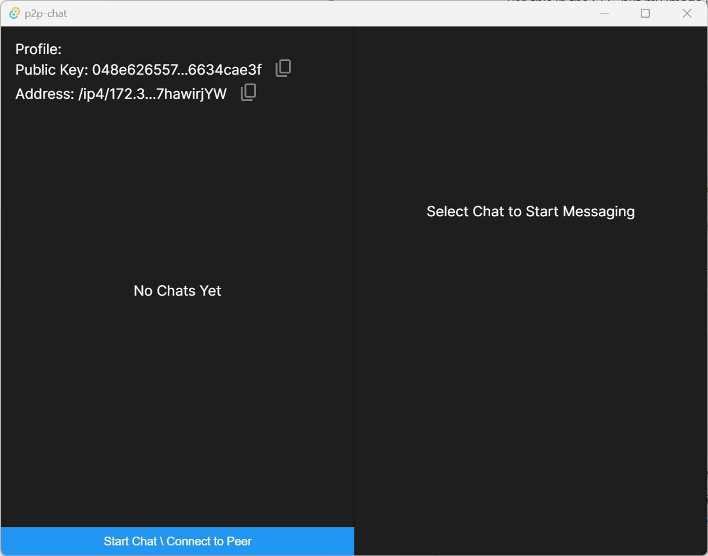
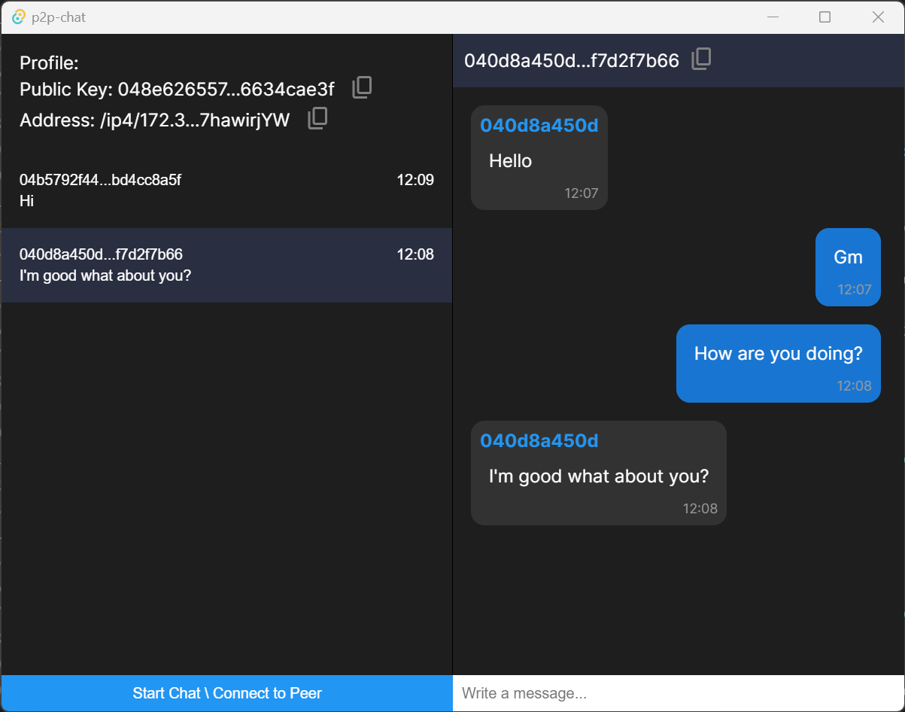

# Tauri P2P Chat

This application lets users connect to each other through a P2P network, using [libp2p](https://github.com/libp2p/rust-libp2p). 

Its built using [tauri](https://tauri.app/) enabling the use of Rust to handle the P2P network, and [NextJs](https://nextjs.org/) to display the UI.

  

## Overview
Upon starting the app BE spins up a P2P network node generating a PeerID, and using PubSub subscribes to messages the `chat` topic. The FE generates a Private Key and displays the corresponding Public Key to the user.
The PeerID can then be used to identify and connect to other nodes on the P2P network, while the public key is used to identify the intended recipient of the messages. Since messages are broadcasted over the P2P network, a layer of encryption is added on the message by encrypting using the Public Key of the intended recipient. This way even tough messages get transmitted over the P2P network, only the intended recipient can use their Private Key to unecrypt the message and read its content.
## Usage


To start the app run
```sh
npm run tauri dev
```

By clicking on `Start Chat` button, you'll be able to insert the public key of the user you wish to chat with. Any message typed will then be encrypted using the user public key and sent over the P2P network.